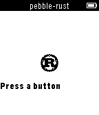

##Pebble.rs Template

This is a template application demonstrating the use of
[Pebble.rs](https://github.com/andars/pebble.rs). It includes the modified
`wscript` and a build script that performs the necessary tasks to link in the
`pebble` crate. This is very hacky but it works and I haven't been able to
figure out any better solutions that actually work.

In order to build, clone [pebble.rs](https://github.com/andars/pebble.rs) to
somewhere on your computer and modify the `path` in Cargo.toml as appropriate.

Don't be fooled by the Cargo.toml, building is actually accomplished with
`./build.sh` rather than `cargo build`. Cargo is only used to build
dependencies.

*This is very much a work in progress*

###Screenshots

##So umm...

If I were to express my thoughts about this project in pictures, I would have
to go with these two.

It started out with good intentions, and it is slowly growing more and more
fragile. This is due to the fact that I wanted to keep using Pebble's waf
infrastructure and existing build process, which requires linking in all the
object files separately. It does work, but if you can think of a better method
please do let me know.

